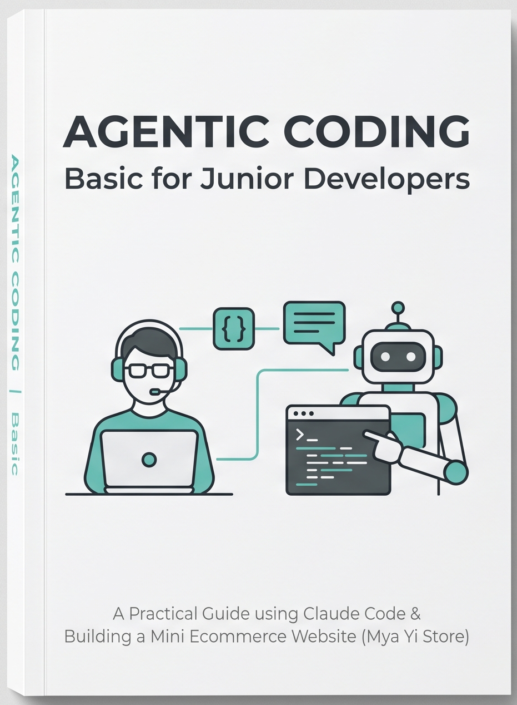

<div align="center">

# AGENTIC CODING Basic for Junior Developers


</div>

---

> "ကျုပ်တို့ငယ်ငယ်က ကုဒ်ဆိုတာ ကိုယ်တိုင်ရေးမှ ရတယ်။
> အခုခေတ်ကျတော့ ကုဒ်ကို စကားပြောပြီး ရေးခိုင်းလို့ရနေပြီ။
> ဒါကို မသိရင် ခေတ်နောက်ကျတယ်။ သိပြီး မသုံးတတ်ရင် ပိုဆိုးတယ်။"



## ဒီစာအုပ်က ဘာအကြောင်းလဲ

Agentic Coding ဆိုတာ ဘာလဲဆိုတာကနေစပြီး **Claude Code** ကိုသုံးကာ **Mini Ecommerce Website** တစ်ခု (ရပ်ကွက်ထဲက ဒေါ်မြရီရဲ့ ကုန်စုံဆိုင်ကို အွန်လိုင်းတင်ပေးမယ့် "မြရီစတိုး") ကို အစအဆုံး တည်ဆောက်သွားတဲ့ လက်တွေ့သင်ခန်းစာ စာအုပ်ပါ။ Noob/Junior Developer တွေအတွက် ရည်ရွယ်ပြီး ပေါ့ပေါ့ပါးပါး စကားပြောဟန်နဲ့ ရေးထားပါတယ်။

## ဘာဆောက်မလဲ

React + Vite + Tailwind CSS နဲ့ ဆောက်မယ့် "မြရီစတိုး" ရဲ့ ဝယ်သူ ခရီးစဉ်က ဒီလို —

```
[ ပစ္စည်းစာရင်း ] → [ ဈေးခြင်းတောင်း ] → [ Checkout Form ] → [ Order Summary ] → [ Viber ပို့ ]
  Product List        Cart                 (နာမည်/ဖုန်း/လိပ်စာ)   (Screenshot ရိုက်)   ဒေါ်မြရီဆီ ရောက်
```

Backend မလိုဘဲ (Server ငှားစရာ မလို) စတင်နိုင်ပြီး၊ Order ကို ဒေါ်မြရီရဲ့ Viber ဆီ Screenshot နဲ့ ပို့တဲ့ မြန်မာ့နည်း မြန်မာ့ဟန် ဖြေရှင်းချက်နဲ့ အဆုံးသတ်ပါတယ်။

## မာတိကာ

| အခန်း | ခေါင်းစဉ် | အကြောင်းအရာ |
|---|---|---|
| ၁ | [Agentic Coding ဆိုတာ ဘာကောင်လဲ](chapters/01-what-is-agentic-coding.md) | AI ကို လက်ထောက်ခန့်ခြင်း အနုပညာ။ Autocomplete နဲ့ Agent ဘာကွာလဲ။ |
| ၂ | [Claude Code ဆိုတဲ့ လူပျိုကြီး Terminal ထဲရောက်လာခြင်း](chapters/02-meet-claude-code.md) | Claude Code မိတ်ဆက်၊ Install လုပ်နည်း၊ ပထမဆုံး စကားပြောကြည့်ခြင်း။ |
| ၃ | [Agent ကို အလုပ်ခိုင်းတတ်အောင် သင်ခြင်း](chapters/03-how-to-instruct-agents.md) | CLAUDE.md၊ Plan Mode၊ Prompt ရေးနည်း ရေးဟန်။ |
| ၄ | [Mini Ecommerce Project စတင်ခြင်း](chapters/04-starting-the-project.md) | ဒေါ်မြရီဆိုင် Online တက်ခြင်း — Setup ကနေ Product List အထိ။ |
| ၅ | [Feature တွေ တစ်ခုချင်း ဆောက်ခြင်း](chapters/05-building-features.md) | Shopping Cart နဲ့ Checkout ကို Agent နဲ့ တစ်ဆင့်ချင်း တည်ဆောက်ပုံ။ |
| ၆ | [Bug ရှာခြင်း၊ Test ရေးခိုင်းခြင်း](chapters/06-bugs-and-testing.md) | Production Bug ကို Agent နဲ့ ကိုင်တွယ်နည်း၊ Regression Test။ |
| ၇ | [Skill ဆိုတဲ့ လက်စွဲကျမ်း — တစ်ခါရေး အမြဲသုံး](chapters/07-skills.md) | Skill ဆောက်နည်း၊ SKILL.md ဖွဲ့စည်းပုံ၊ ပြန်သုံးနည်း သုံးမျိုး။ |
| ၈ | [Context Window နဲ့ Token စီးပွားရေး](chapters/08-context-window-and-tokens.md) | Agent ရဲ့ မှတ်ဉာဏ်ခွက်၊ Token ချွေတာနည်း (၇) သွယ်။ |
| ၉ | [Junior Developer တစ်ယောက်အနေနဲ့ မမေ့သင့်တဲ့ အချက်များ](chapters/09-final-words.md) | နိဂုံးချုပ် ဩဝါဒနဲ့ အမြန်ကိုးကားရန် စာရင်း။ |

## ဘယ်လိုဖတ်ရမလဲ

အခန်း (၁) ကနေ အစဉ်လိုက်ဖတ်ဖို့ အကြံပြုပါတယ်။ အခန်းတိုင်းရဲ့ အောက်ခြေမှာ ရှေ့အခန်း/နောက်အခန်း သွားလို့ရတဲ့ Link တွေ ပါပါတယ်။

ဖတ်ရုံသက်သက် မဟုတ်ဘဲ **စာအုပ်ထဲက Command တွေ၊ Prompt တွေကို ကိုယ်တိုင် လိုက်ရိုက်ကြည့်ပါ။** Agentic Coding ဆိုတာ စက်ဘီးစီးသင်တာနဲ့ အတူတူပါပဲ — စာအုပ်ဖတ်ရုံနဲ့ မတတ်ပါဘူး။

## လိုအပ်ချက်များ

- ကွန်ပျူတာ (macOS / Windows / Linux)
- [Claude Code](https://code.claude.com/docs/en/overview) — Pro/Max/Team/Enterprise Plan သို့မဟုတ် Console Account လိုအပ်သည်
- Git အခြေခံ အသုံးပြုတတ်ခြင်း

---

<div align="center">

**[📖 အခန်း (၁) ကနေ စဖတ်မယ် →](chapters/01-what-is-agentic-coding.md)**

</div>
